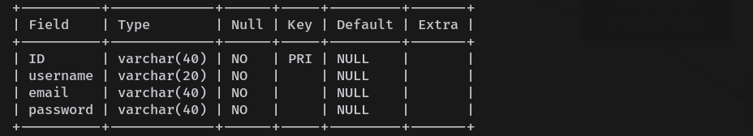
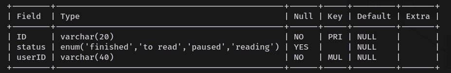
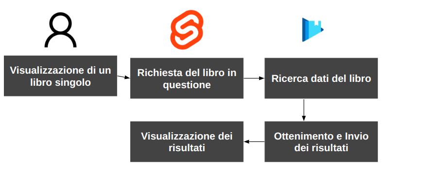

# Booklib
Questo progetto ha lo scopo di facilitare l'organizzazione della lettura fornendo la possibilità di salvare una lista di libri che l'utente ha letto, sta leggendo o ha intenzione di leggere in futuro; tutto questo con la possibilità di avere due modalità di visualizzazione una minimale e una completa con immagini.
## Panoramica Applicazione

### Minimal View

#### Home Page 

#### Ricerca (Home Page) 

### Complete View

#### Home Page 

#### Ricerca (Home Page)

### Visualizzazione di un libro

### Riconoscimento Utente

 

## Tecnologie Utilizzate

 <h2> Backend </h2> 

     
     
    
    

 

**Python** è il linguaggio di programmazione scelto per il backend grazie alla sua semplicità e versatilità. Permette di sviluppare rapidamente funzionalità robuste e scalabili.

**MySQL** è un sistema di gestione di database relazionali utilizzato per memorizzare le informazioni sui libri. È affidabile e performante, ideale per gestire grandi quantità di dati.

**L'API di Google Books** viene utilizzata per recuperare informazioni dettagliate sui libri, come la copertina, l'autore, e la descrizione, migliorando così l'esperienza dell'utente.

**Flask** è un micro-framework web per Python. È leggero e modulare, permettendo agli sviluppatori di scegliere le componenti da integrare. Perfetto per creare applicazioni web rapide e performanti.

 <h2> Frontend </h2> 

     
     

 

**Vite** è un tool di build di nuova generazione che offre un ambiente di sviluppo rapido e snello. Permette di sviluppare applicazioni web moderne con una configurazione minima.

**Svelte** è un framework JavaScript per la creazione di interfacce utente. A differenza di altri framework, Svelte compila il codice in JavaScript altamente ottimizzato durante la build, migliorando le prestazioni runtime.

 <h2> System </h2> 

     

 

**Bash** è una shell Unix e un linguaggio di scripting che consente di automatizzare diverse operazioni di sistema. Viene utilizzato per gestire script di deploy e automazione delle operazioni server-side.

## Schema del database

## Flusso di Lavoro

### Avvio
 

L'utente per utilizzare l'applicazione esegue un file con estensione .bash che avvia, automaticamente, l'applicazione nella sua interezza e apre una finestra nel browser per la visualizzazione delle pagine 

### Signup
 

### Login
 

### Home Page
 

### Ricerca (in home page)
 

### Pagina Libro Singolo
 

### Aggiunta o Rimozione di un Libro alla Lista 
 

### Modifica Stato di un Libro
 

## Altre Informazioni

[Zip Del Progetto](https://drive.google.com/file/d/1M6sZ6NiGEbhuaiqp1JWpYVrFQJNUfYZW/view?usp=sharing)